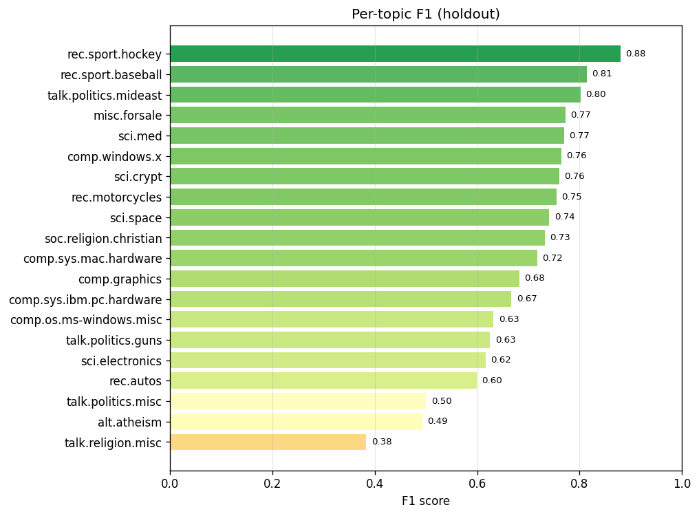
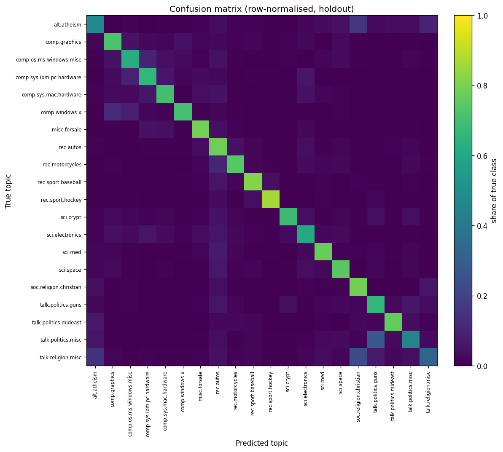
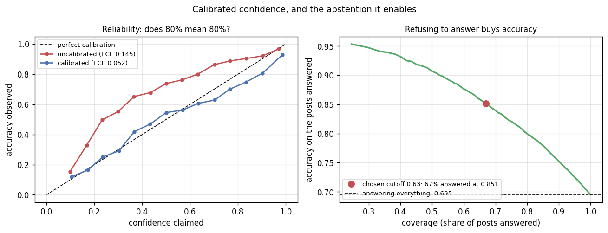

# News Topic Classifier — and *why* it picked that topic

Classify a piece of text into one of 20 newsgroup topics, and — the part most
write-ups skip — show **which words drove the decision**. Built on the classic
[20 Newsgroups](http://qwone.com/~jason/20Newsgroups/) corpus (~18,800 Usenet
posts) with a deliberately interpretable TF-IDF + logistic-regression pipeline,
wrapped in a Streamlit demo.

```
┌── paste text ─────────────────────────────────────────────┐
│  "The spacecraft entered orbit around Mars after a         │
│   seven-month journey; NASA confirmed the burn..."         │
└───────────────────────────────────────────────────────────┘
        │
        ▼   TF-IDF (1–2 grams)  →  logistic regression
        │
   ┌────────────────────┐   ┌──────────────────────────────────┐
   │ sci.space   99%     │   │ why?  orbit  +2.20               │
   │ talk.mideast 0.4%   │   │       spacecraft +1.88           │
   │ sci.med      0.2%   │   │       nasa +1.67  mars +1.32     │
   └────────────────────┘   └──────────────────────────────────┘
```

[Русская версия](README.ru.md)

---

## The decision behind it

The shape of this problem is a routing queue: text arrives, something has to send it
to the right place, and a wrong route costs whatever it costs to notice and redo it.
Framed that way the interesting question is not "how accurate" but **where the machine
should stop deciding** — a router that is 70% right on everything is usually worse than
one that is 85% right on two thirds and hands the rest to a person.

That is what this repository ends with: **67% coverage at 0.851 accuracy**, against
0.695 if it answers everything. The calibration work in §4 is what makes the cutoff
pickable at all, and the per-word explanation in §1 is what makes a wrong route
reviewable in seconds instead of being a verdict from nowhere.

20 Newsgroups is a public research corpus with no client behind it, so the routing
frame is one this data supports rather than one anybody asked for. What it cannot tell
you is the exchange rate: whether 33% of traffic going to a human is cheap or ruinous
depends on review cost, which no public dataset carries.

---

## Results

Trained on message **content only**, evaluated on the official by-date test
split (7,532 posts the model never saw, written *later* than the training set):

| Metric | Score |
|---|---|
| Accuracy | **0.695** |
| Macro-F1 | **0.685** |
| Weighted-F1 | 0.695 |
| Classes | 20 |
| Regularisation `C` | 10.0 (chosen by CV) |

That is not a flashy number, and it is not supposed to be — see the leakage
section below for why the honest version of this task tops out far lower than
the 0.90+ you will see in most notebooks.

Per-topic F1 ranges from **0.88** (rec.sport.hockey — a topic with its own
unmistakable vocabulary) down to **0.38** (talk.religion.misc — a catch-all that
overlaps heavily with atheism and Christianity):



---

## What makes this more than a fit-predict script

### 1. Every prediction is explained

Because the model is linear over TF-IDF features, the score for a topic is a sum
of per-word contributions:

```
score(topic) = bias + Σ  tfidf(word) × weight[topic, word]
                    word in text
```

So for any input we can rank the words by how hard they pushed the decision —
computed on *your* text, not read off a global table. Verified on real inputs:

| Input (paraphrased) | Predicted | Top contributing words |
|---|---|---|
| "spacecraft entered orbit around Mars, NASA confirmed the burn" | `sci.space` (99%) | orbit, spacecraft, nasa, mars |
| "the clipper chip is a government backdoor into encrypted messages" | `sci.crypt` (100%) | encryption, clipper, government, encrypted |
| "the goalie stopped 45 shots, went to overtime in the playoffs" | `rec.sport.hockey` (81%) | playoffs, shots, overtime, goalie |

This is the whole reason for choosing a linear model over something heavier: a
gradient-boosted or neural model would likely score a little higher and could
not hand you this explanation as cleanly. For a topic classifier, being able to
say *why* is worth more than a point or two of accuracy.

The same mechanism gives each topic's learned "definition" — its highest-weight
words — which doubles as a sanity check that the model learned subject matter and
not noise:

| Topic | Top words |
|---|---|
| sci.space | space, orbit, launch, nasa, spacecraft, moon |
| rec.sport.hockey | hockey, team, game, nhl, season |
| sci.crypt | encryption, clipper, key, nsa, government, security |

### 2. The metadata leak, measured

The raw posts carry their newsgroup name in the **headers**, recurring poster
signatures in the **footers**, and quoted parent text that is usually on-topic.
Train on all of that and accuracy jumps — but the model is reading metadata, not
understanding language. Most public 20 Newsgroups results quietly leave these in.

The shipped model strips them (`remove=('headers','footers','quotes')`), and the
cost of that honesty is measured rather than hand-waved
([`reports/leakage_comparison.json`](reports/leakage_comparison.json)):

| Same pipeline, trained on… | Accuracy | Macro-F1 |
|---|---|---|
| Content only | 0.694 | 0.679 |
| Content + headers/footers/quotes | 0.838 | 0.832 |
| **Inflation from the leak** | **+0.144** | **+0.153** |

Fourteen points of "accuracy" for free — and worthless, because a real post's
headers are exactly what you would not have if you were trying to route it in the
first place.

<sub>Both rows use the default `C=1.0` so the only thing that changes is the
feature set — this isolates the leak, not the tuning. The shipped model adds the
CV-tuned `C=10`, which lifts content-only accuracy to the 0.695 in the results
table above.</sub>

### 3. The mistakes are the *reasonable* kind

A 20×20 confusion matrix is hard to read, so the model's errors are summarised as
its most frequent (true → predicted) confusions. **All ten of the top confusions
are between sibling topics** — two `comp.*` groups, or atheism vs Christianity —
rather than wild misfires:

| True topic | Predicted as | Count | Siblings? |
|---|---|---|---|
| talk.politics.misc | talk.politics.guns | 88 | ✓ |
| talk.religion.misc | soc.religion.christian | 58 | ✓ |
| alt.atheism | soc.religion.christian | 49 | ✓ |
| comp.windows.x | comp.graphics | 48 | ✓ |
| rec.motorcycles | rec.autos | 41 | ✓ |

The block structure is visible in the confusion matrix — bright clusters line up
with the super-categories (`comp.*`, the `talk.*`/religion group):



A classifier that confuses hockey with cryptography is broken; one that confuses
two flavours of PC hardware is behaving sensibly on a genuinely fuzzy boundary.

### 4. The confidence means something — so the model can refuse to answer

The demo prints a probability next to every prediction, and for a while nobody
had checked whether that number was worth anything. It was not:

| | Mean confidence | Accuracy | ECE | MCE |
|---|---|---|---|---|
| Raw softmax | 0.551 | 0.695 | **0.145** | 0.286 |
| After temperature scaling | 0.733 | 0.695 | **0.052** | 0.096 |

The model was **under-confident** — claiming 55% while being right 70% of the
time. That is the less famous direction (neural networks are known for the
opposite) and it is what L2 regularisation on sparse text does: shrinking the
weights shrinks the logits, and the softmax flattens.

One parameter fixes it. Temperature scaling divides every logit by a single
number, `T = 0.566` here, fitted by minimising NLL on **out-of-fold** logits —
in-sample logits are the model's opinion of documents it has already seen the
answers to. Because it is monotone and applied to every class equally, the
arg-max cannot move: accuracy, macro-F1, the confusion matrix and every word
contribution are identical before and after. A test asserts exactly that.



**And now the confidence can carry a decision.** With 20 topics and no "none of
the above" class, the model is forced to name a newsgroup for a sourdough recipe.
A calibrated confidence turns that into an abstention rule — answer above the
cutoff, send the rest to a human:

```
threshold chosen on the training folds:  0.63  (68.0% coverage at 0.902 accuracy)
the same threshold on the holdout:             67.0% coverage at 0.851 accuracy
                                               vs 0.695 when answering everything
```

Two things worth saying about those numbers. The threshold is picked on the
training folds and only *measured* on the holdout — choosing the cutoff that hits
90% on the test set and then reporting 90% on the test set would be circular.
And it misses: it targeted 0.90 and delivered 0.851. That gap is the by-date
split doing its job. The test posts were written later than the training posts,
so a threshold tuned on the training period degrades on them — which is precisely
what a threshold does after deployment, visible here rather than six months in.

Fifteen and a half points of accuracy on two thirds of the traffic, in exchange
for routing the other third to a person, is a real product trade — and the
right-hand curve above is the exchange rate at every other cutoff.

---

## The interactive demo

```bash
streamlit run app/streamlit_app.py
```

Paste any text (or pick a built-in example) and get the predicted topic, the
probability spread across all 20 topics, and the per-word contribution panel.
The demo loads the trained artifact and reuses the exact `explain_prediction`
function the tests cover — no logic duplicated between the app and the library.

The confidence shown is the calibrated one, and below the 0.63 cutoff the app
says it is not sure instead of presenting a guess as an answer — the built-in
"None of the 20 topics" example is there to show it happening. Both the
temperature and the threshold travel inside `model.joblib`, so the demo cannot
drift away from the numbers in `reports/`.

---

## Running it

```bash
git clone https://github.com/diskaver-it/news-topic-classifier
cd news-topic-classifier
pip install -e ".[dev]"

python -m news_classifier.train        # downloads 20NG once (~15 MB), trains, writes reports/
pytest -q                              # 45 tests, no network required
streamlit run app/streamlit_app.py     # the demo
```

Training takes a couple of minutes, most of it the cross-validation sweep over
`C` and the out-of-fold pass the temperature is fitted on. The download happens
once and is cached under `data/raw/`.

---

## Design choices, briefly

**Why TF-IDF + logistic regression.** The honest strong baseline for topic
classification, interpretable per prediction, trains in seconds, and produces a
small artifact the demo can load instantly. Reaching for a transformer first
would be the wrong instinct to show — and would forfeit the explanations.

**Why macro-F1, not accuracy.** Accuracy weights every document equally, so a
model can coast on the easy, well-separated topics. Macro-F1 averages F1 *per
class*, so a topic the model cannot handle (talk.religion.misc) drags the score
down — which is exactly what you want to surface. `C` is tuned against macro-F1
for the same reason.

**Why the official by-date split.** 20 Newsgroups ships a train/test split where
the test posts are from a later time period. That mirrors deployment — you always
predict on text written after training — so reshuffling would leak future posts
into training and flatter the numbers.

**`sublinear_tf` + bigrams.** Word informativeness grows with frequency but not
linearly, so counts become `1 + log(count)`; bigrams let "hard drive" and "new
york" be features rather than dissolving into single words.

---

## Layout

```
src/news_classifier/
├── config.py     paths, dataset settings, topic → super-category map
├── data.py       load the official train/test split (cached, offline after first run)
├── model.py      the TF-IDF + logistic-regression pipeline
├── train.py      CV tuning, fit, the leakage experiment, persistence
├── evaluate.py   macro-F1, per-class report, top confusions
├── explain.py    per-prediction word contributions + per-topic defining words
├── calibration.py temperature scaling, ECE, and the abstention threshold
└── plots.py      confusion matrix, per-class F1, top features, calibration figures

app/streamlit_app.py   the interactive demo
tests/                 45 tests on a synthetic corpus — no network, ~10s
reports/               metrics.json, leakage_comparison.json, calibration.json,
                       top_features_per_topic.json, figures/
```

Raw data and the trained artifact are gitignored — both are regenerated by
`python -m news_classifier.train`, and committing binaries makes diffs useless.

---

## Known limitations

- **No deep-learning baseline.** A fine-tuned transformer would likely beat this
  on raw accuracy. It would also be slower, larger, and far harder to explain —
  the trade-off is the point, not an oversight. A fair comparison would be a good
  next step.
- **English, single-label, topic-level.** The model still assumes one of these 20
  topics; abstention lets it decline to answer, which is not the same as having a
  "none of the above" class, and it has no notion of a document spanning two
  topics.
- **Vocabulary is frozen at training time.** New jargon (a product or event that
  post-dates the corpus) contributes nothing until the model is retrained.
- **Calibration is global, not per class.** One temperature for all 20 topics.
  The topics the model handles badly (talk.religion.misc, F1 0.38) are probably
  miscalibrated in their own direction, and per-class or vector scaling would
  catch that — at the cost of 20 parameters fitted on far less data each.
- **The abstention threshold is one number, chosen once.** A real router would
  set it per topic, or from the cost of a wrong answer versus the cost of human
  review, rather than from a round 90% target.

## Licence & attribution

Code: MIT. Dataset: the 20 Newsgroups collection, distributed with scikit-learn;
originally assembled by Ken Lang.
